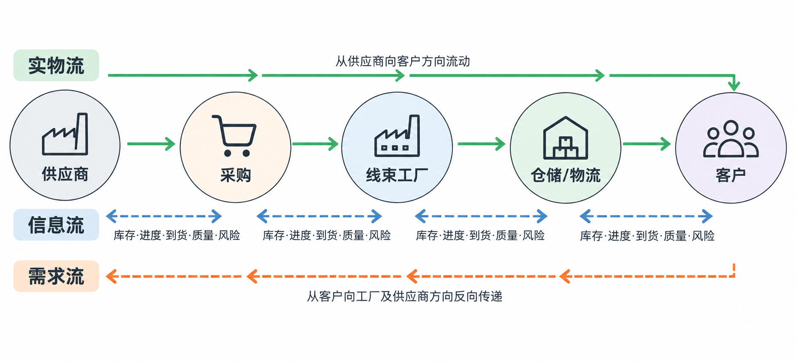
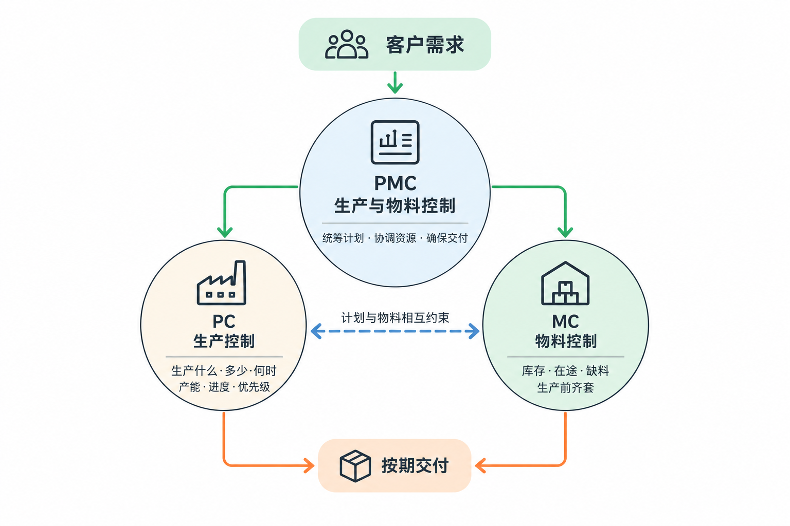
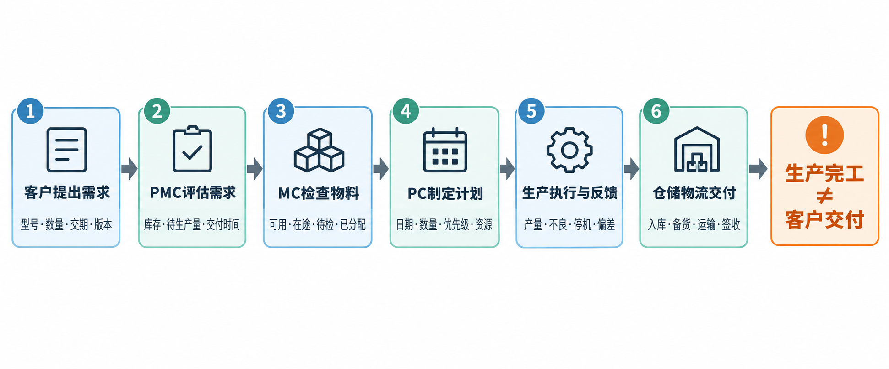
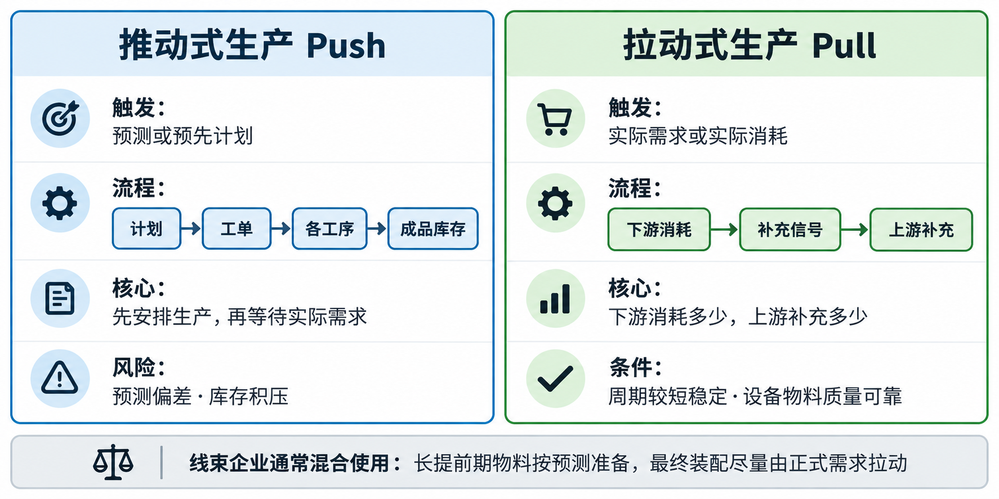
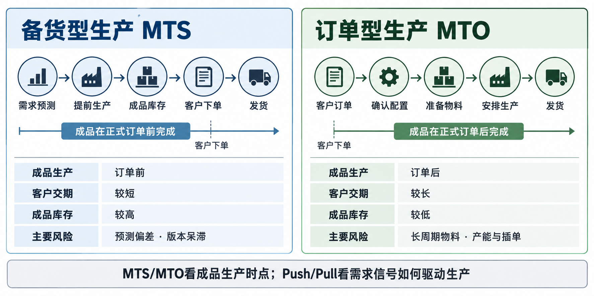
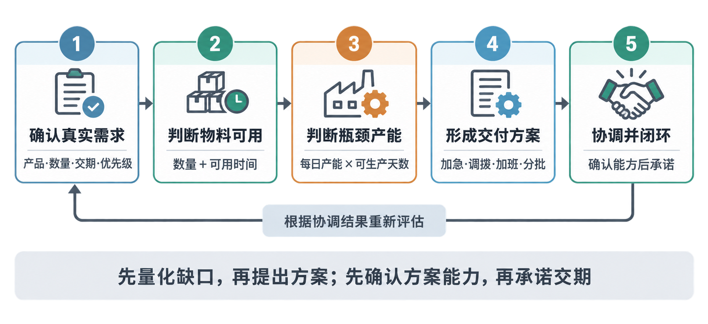

# 01-供应链基础

[toc]

<div style="page-break-after:always"></div>

## 1.1 供应链到底要解决什么问题？

### 业务场景

BYD内部客户要求线束工厂在下周五交付：

- 产品：`WH-A100` 前门线束
- 数量：1,000 套
- 当前成品库存：100 套
- 生产周期：3 天
- 一种关键进口连接器采购提前期：4 周
- 该连接器当前库存：700 个
- 每套线束需要：1 个连接器

表面上，这是一个“生产1,000套线束”的任务。

但工厂不能只看生产数量。它必须同时回答：

- 客户真正需要什么时间、多少数量？
- 现有库存能交多少？
- 剩余数量能否按时生产？
- 原材料是否齐套？
- 关键连接器短缺多少？
- 采购能否在生产前到货？
- 车间设备和人员是否有足够产能？
- 完工后能否及时检验、入库和运输？

这就是供应链问题：**不是某一个部门把自己的工作完成，而是整个链条共同完成客户交付。**

### 什么是供应链

供应链（Supply Chain）是围绕客户需求，将供应商、采购、生产、仓储、物流和客户连接起来的业务网络。

在线束工厂中，可以先把它理解为三种流动：

1. **需求流**

   客户预测、正式订单和交期要求，从客户传向工厂及供应商。

2. **实物流**

   原材料从供应商进入工厂，经过加工成为线束，再交付给客户。

3. **信息流**

   库存、生产进度、采购到货、质量状态和交付风险等信息，在各部门之间传递。

简化业务链路如下：



供应链管理的核心不是单纯追求“库存最低”或“产量最高”，而是平衡：

- 客户交付
- 库存占用
- 生产效率
- 采购成本
- 供应风险
- 质量要求

例如，采购部门为了降低价格一次购买大量连接器，可能降低单价，却造成库存积压；生产部门为了提高设备利用率大量生产 `WH-A100`，也可能产生客户暂时不需要的成品。

因此，**局部最优不等于供应链整体最优。**

### PMC 的基础判断顺序

面对客户订单时，不能只计算需要生产多少，还要按顺序确认：

1. 客户需求：数量、交期和优先级是否明确。
2. 成品库存：现有合格成品能满足多少需求。
3. 物料：全部关键物料是否齐套，而不只是检查一种物料。
4. 产能：设备、人员和工序时间是否支持计划。
5. 质量：考虑不良率或合格率后，投入量能否得到足够的合格品。
6. 交付：检验、入库和运输是否能在客户要求日期前完成。

基本思路是：**先确认需求，再检查库存、物料、产能和时间，最后判断能否交付。**

生产部门主要负责如何完成生产，但订单能否按期交付还受库存、物料、质量和物流影响，因此不能只由生产部门独立判断。

<div style="page-break-after:always"></div>

## 1.2 PMC、PC 与 MC 的职责

生产与物料控制（Production and Material Control, PMC）负责协调生产计划与物料供应，使客户需求、物料和产能能够衔接。

<div align="center">
  
</div>

### 生产控制（Production Control, PC）

PC主要管理“生产什么、生产多少、何时生产以及是否完成”，常见职责包括：

- 编制和调整生产计划
- 下达、跟踪工单
- 安排订单优先级
- 跟踪生产进度与在制品
- 处理插单、设备故障和人员不足
- 评估计划能否按期完成

> PC关注的核心问题是：**生产能否按照交期和数量完成？**

### 物料控制（Material Control, MC）

MC主要管理“生产所需物料能否按数量和时间准备好”，常见职责包括：

- 根据生产需求检查物料需求
- 检查库存、在途和可用数量
- 编制与跟踪缺料清单
- 跟踪采购到货
- 协调替代料和跨订单物料调拨
- 控制物料积压和呆滞风险

> MC关注的核心问题是：**物料能否在生产开始前齐套？**

### PC 与 MC 的协同

PC与MC不能割裂：

```text
客户需求
   ↓
PMC协调
   ├── PC：什么时候生产，产能是否足够
   └── MC：什么时候要料，物料是否齐套
   ↓
按期完成并交付
```

常见判断原则：

- 缺料风险由MC牵头处理，PC根据物料可用时间调整生产计划。
- 产能不足由PC牵头处理，必要时重新安排人员、工位和订单顺序。
- 客户插单通常由PC评估能否排入，由MC确认物料能否支持，最终由PMC综合判断插单代价。

不同企业可能将PC和MC设置在同一部门，也可能分别归属计划、生产或供应链部门；组织名称可以不同，但生产与物料必须协同的业务逻辑不变。

<div style="page-break-after:always"></div>

## 1.3 从客户订单到成品交付

客户订单不能直接转交车间生产。完整业务链路需要依次确认需求、库存、物料、产能、生产执行和交付条件。



### 1. 客户提出需求

需要确认产品型号、数量、要求交期、交付地点、产品版本，以及需求属于预测还是真实订单。产品版本错误时，即使数量和时间满足，产品也可能无法交付。

### 2. PMC评估需求

PMC检查成品库存、待生产数量、物料、产能和交付时间。例如：

```text
客户需求：1,000套
合格成品库存：100套
初步生产需求：1,000 - 100 = 900套
```

900套只是初步生产需求，不等于已经可以执行的生产计划。

### 3. MC检查物料

MC不仅查看账面库存，还要检查：

- 仓库可自由使用数量
- 已被其他订单分配或预留的数量
- 在途采购数量和预计到货日期
- 待检验、冻结或不合格数量
- 替代料和调拨可能性

账面库存不等于可用库存。计划和缺料判断必须以可用数量为基础。

### 4. PC制定生产计划

在物料和产能基本可行后，PC安排投产日期、每日数量、订单优先级、设备、工位和人员，并给出预计完工时间。

### 5. 生产执行与反馈

生产部门按照下线、剥皮/压接、子装配、总装、电测、外观检查和包装等工序执行，并反馈实际产量、不良、停机和进度偏差。

### 6. 仓储和物流完成交付

合格品还要完成入库、备货、出库、装车、运输和客户签收。因此，**生产完工日期不等于客户交付日期。**

### 信息错误的传递影响

```text
需求错误
→ 计划错误
→ 采购错误
→ 生产错误
→ 库存或交付问题
```

供应链中的关键工作之一，是让正确的信息在正确时间传递给正确的部门。

<div style="page-break-after:always"></div>

## 1.4 推动式与拉动式生产



### 推动式生产

推动式生产（Push Production）是根据预测或预先制定的计划，将生产任务逐级向后续工序推动。

```text
需求预测
→ 制定生产计划
→ 下达工单
→ 各工序按计划生产
→ 成品入库
→ 等待客户提货
```

>  核心特点是：**先根据预计需求安排生产，再等待实际需求消耗产品。**

推动式适合需求相对稳定、生产或采购提前期较长、客户要求交货时间较短，或者必须按经济批量组织生产的场景。

主要风险包括：

- 预测偏高导致成品或物料积压
- 预测偏低仍然无法满足客户需求
- 产品版本变更后，旧版库存成为呆滞品
- 各工序只完成自己的计划，造成在制品过高

### 拉动式生产

拉动式生产（Pull Production）是由下游的实际需求或实际消耗触发上游补充。

```text
客户或下游发生实际消耗
→ 发出补充信号
→ 上游按消耗数量补充
→ 继续向更上游传递需求
```

拉动信号可以来自正式订单、下游实际消耗、空料箱、看板或库存补充点。

> 其核心特点是：**下游需要或消耗多少，上游再补充多少。**

拉动式可以减少过量生产、在制品、成品库存和预测错误造成的浪费，但需要较短且稳定的供应与生产周期，以及可靠的设备、物料和质量条件。

### 拉动不等于零库存或不做计划

如果上游生产和配送需要时间，下游仍需保留合理的周转库存，并设置补充数量和触发时点。需求突然增加时，原有拉动参数可能跟不上实际消耗。

即使采用拉动方式，PMC仍需使用预测提前准备：

- 长提前期连接器和关键端子
- 人员与设备产能
- 供应商产能
- 必要的周转库存

### 线束企业的混合方式

实际企业通常混合使用推动和拉动：

```text
长提前期物料：根据预测推动备料或采购
通用半成品：根据计划适度准备
最终装配：尽量由正式订单或实际消耗拉动
```

例如，进口连接器采购提前期为4周，而客户正式订单只提前1周下达，就不能等正式订单出现后再采购。但这并不意味着要根据预测提前生产大量客户专用成品。

> 基本原则是：**越接近通用物料，可以越早准备；越接近客户专用成品，越应谨慎提前生产。**

备料数量还要结合预测准确率、安全库存、最小起订量、物料通用性、工程变更风险和供应商交货能力综合判断。

<div style="page-break-after:always"></div>

## 1.5 备货型生产与订单型生产



### 备货型生产（Make to Stock, MTS）

MTS是根据预测提前生产成品并存入仓库，客户下单后直接从库存发货。

```text
需求预测
→ 提前采购和生产
→ 成品入库
→ 客户下单
→ 从库存发货
```

MTS适合需求稳定、产品标准化程度高、版本变化较少、客户要求快速交货且预测准确率较高的产品。

主要特点：

- 客户交期较短
- 便于提前安排产能和批量生产
- 成品库存较高
- 预测错误、产品变更和库存呆滞风险较高

> MTS不等于库存越多越好，PMC仍需根据预测准确率、现有库存、客户交期和版本风险确定合理备货量。

### 订单型生产（Make to Order, MTO）

MTO是收到客户正式订单后，才生产对应的产品。

```text
客户正式下单
→ 确认配置和交期
→ 准备物料
→ 安排生产
→ 检验和发货
```

MTO适合客户配置差异大、产品专用性强、需求波动大、成品价值高或版本变化频繁的产品。

主要特点：

- 成品库存和错配置风险较低
- 生产数量更接近真实需求
- 客户等待时间较长
- 长提前期物料、产能不足和插单容易造成订单延期

实际应用中，可以根据预测提前准备通用长周期物料，但将专用物料和最终装配推迟到正式订单明确后执行。

### MTS与MTO的区别

| 对比项目 | MTS | MTO |
|---|---|---|
| 生产触发依据 | 需求预测 | 客户正式订单 |
| 成品生产时点 | 订单前 | 订单后 |
| 客户交期 | 较短 | 较长 |
| 成品库存 | 较高 | 较低 |
| 预测错误风险 | 较高 | 较低 |
| 适合产品 | 标准、稳定产品 | 专用、多配置产品 |

### MTS/MTO与Push/Pull的区别

两组概念观察的角度不同：

- MTS/MTO回答：**客户订单到来之前还是之后完成产品？**
- Push/Pull回答：**需求信号和任务如何驱动、传递生产？**

MTO可以采用推动式执行。例如，客户正式下达600套订单后，PC将600套任务依次下达到下线、压接和总装工序：成品是在订单后生产，因此属于MTO；生产任务由计划逐级下达，因此内部执行具有Push特征。

如果企业在正式订单600套之外，再为尚未收到的未来订单提前生产200套成品，那么600套属于MTO，额外200套则属于预测备货，具有MTS特征。

<div style="page-break-after:always"></div>

## 1.6 综合订单可行性评估

PMC收到订单或插单后，不能只看单一的库存、物料或产能数据，应按照端到端交付逻辑进行评估。



### 第一步：确认真实需求

确认产品、配置、数量、交期、订单优先级、能否延期以及是否接受分批交付。MTS产品还要检查可用成品库存，MTO产品要确认客户配置是否已经冻结。

```text
需要生产数量 = 客户订单数量 - 可用成品库存
```

### 第二步：判断物料是否按时可用

物料判断不仅要比较总量，还要比较可用时间：

- 当前可用库存
- 已分配、待检、冻结或不合格数量
- 在途数量、到货时间和检验时间
- 替代料及跨订单调拨可能性
- 其他配套物料是否齐套

即使供应商承诺交货，如果物料到达时已经没有足够时间完成检验、生产和发运，也不能解决当前交付问题。

### 第三步：判断瓶颈产能

```text
可用产能 = 每日产能 × 可生产天数
产能缺口 = 生产需求 - 可用产能
```

“可以加班”不是完整结论，必须量化每天能够增加多少合格产量，并确认设备、人员、检验、包装和物流能否同步支持。

### 第四步：形成交付方案

当物料或产能不能满足全部需求时，PMC需要综合比较：

- 供应商加急或紧急运输
- 替代料或跨订单调拨
- 加班、调人、增加班次或外部产能
- 调整订单优先级
- 延期或分批交付

每个方案都要同时说明可增加的数量、可实现的日期、影响的其他订单以及成本和风险。

### 第五步：协调并闭环

- MC确认物料数量及可用日期。
- PC安排生产顺序并量化产能。
- 生产、质量和物流确认执行能力。
- 销售或客户服务确认客户优先级及交付调整。
- PMC汇总信息，形成可执行且能够对客户承诺的方案。

核心原则是：**先量化缺口，再提出方案；先确认方案能力，再承诺客户交期。**
