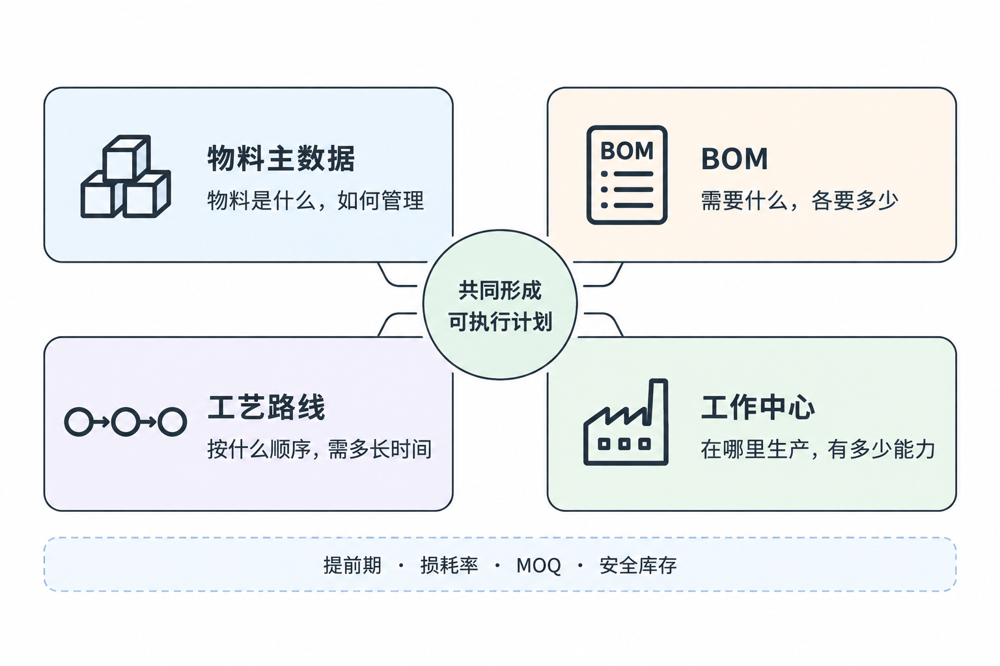
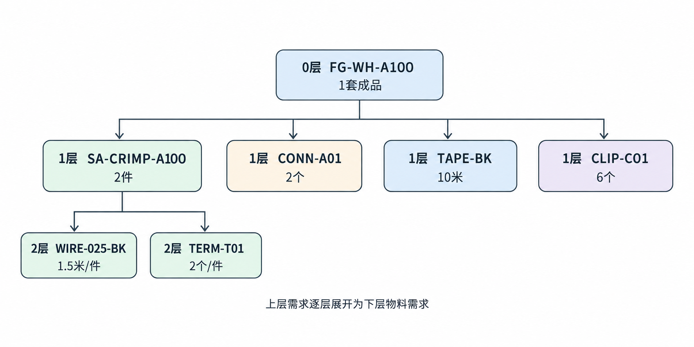
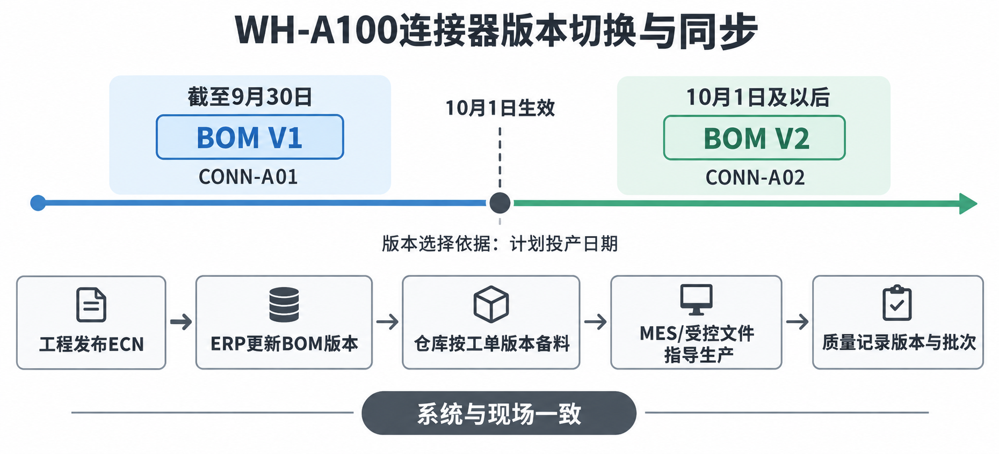
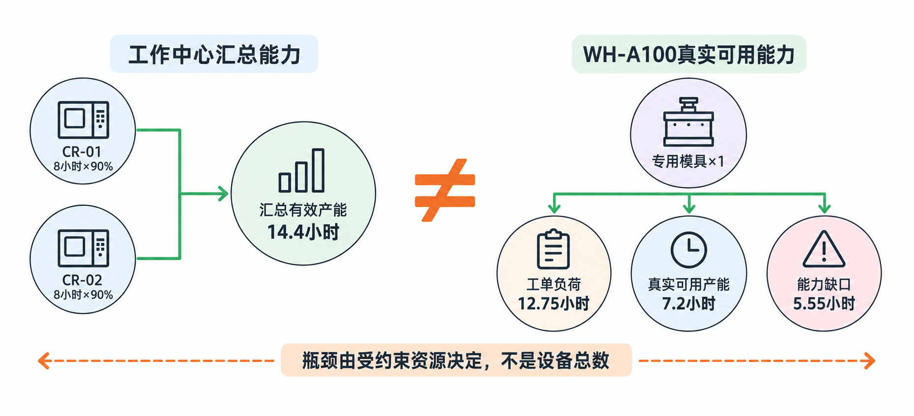
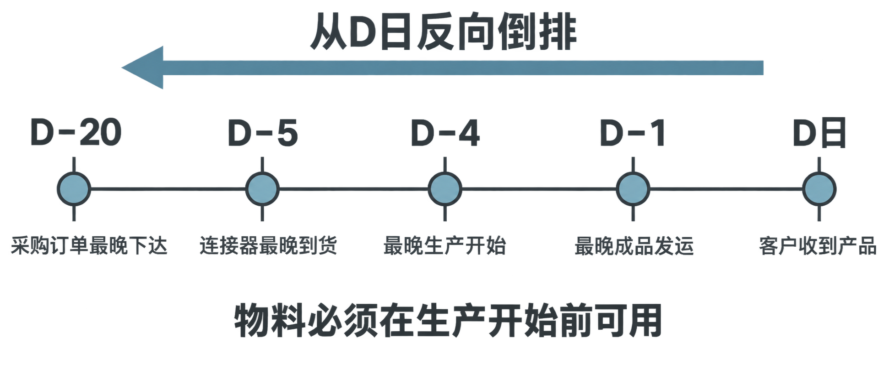

# 02-制造基础数据

[toc]

<div style="page-break-after:always"></div>

## 2.1 制造基础数据为什么重要？

### 业务场景

客户要求生产1,000套 `WH-A100` 前门线束。只有产品、数量和交期，还不能形成可执行的采购与生产计划。PMC还需要知道：

- 每套产品需要哪些物料、各需要多少；
- 产品按照什么工序顺序生产；
- 每道工序在哪个工作中心完成；
- 采购和生产分别需要多长时间；
- 生产过程中有多少损耗；
- 供应商是否有最小起订量和批量限制。

这些信息统称为制造基础数据，也常称为制造主数据（Manufacturing Master Data）。

### 四类核心基础数据

| 基础数据 | 回答的业务问题 | 线束案例示例 |
|---|---|---|
| 物料主数据（Material Master） | 物料是什么，如何管理？ | 端子的物料编码、单位、采购提前期 |
| 物料清单（Bill of Materials, BOM） | 做一个产品需要什么、各要多少？ | 每套线束需要20个端子 |
| 工艺路线（Routing） | 产品按照什么顺序加工？ | 下线→压接→子装配→总装→电测 |
| 工作中心（Work Center） | 工序在哪里完成，有多少能力？ | 压接机组、总装生产线、电测工位 |

<div align="center">
  
</div>

计划还会使用提前期（Lead Time）、损耗率（Scrap Rate）、最小起订量（Minimum Order Quantity, MOQ）、批量规则和安全库存等参数。

### 基础数据如何影响计划

以1,000套 `WH-A100`、每套使用20个端子为例：

```text
客户需求1,000套
→ BOM展开为20,000个端子的基础需求
→ 根据损耗率调整毛需求
→ 扣除可用库存和确定可用的在途量
→ 考虑安全库存
→ 得到净需求
→ 根据MOQ或批量规则确定采购数量
→ 根据采购提前期确定下单时间
```

各项数据的作用不同：

- BOM和损耗率决定理论上需要多少；
- 库存和在途决定还缺多少；
- MOQ或批量规则决定实际要买多少；
- 提前期决定什么时候必须下单。

如果BOM将每套20个端子错误维护为18个，生产1,000套就会少计划：

```text
(20 - 18) × 1,000 = 2,000个端子
```

即使MRP程序完全按照规则计算，也会因为输入数据错误而生成错误结果。

> 基础数据的核心价值：把产品结构、生产方法和计划参数转换成系统可以计算的信息。

### 一物一码

需要独立管理的物料通常应具有唯一的物料编码。例如：

| 物料编码 | 物料名称 | 基本单位 |
|---|---|---|
| `FG-WH-A100` | WH-A100前门线束 | 套 |
| `WIRE-025-BK` | 0.25 mm²黑色电线 | 米 |
| `CONN-A01` | A型连接器 | 个 |
| `TERM-T01` | T01端子 | 个 |

编码的作用不是让名称变复杂，而是准确区分物料。

例如，“黑色电线”这个名称不能唯一确定物料，还可能需要区分：

- 导体截面积
- 绝缘材料
- 颜色
  - 规格标准
- 供应商或认证要求

如果两种不能互换的电线共用一个编码，系统看到的总库存可能充足，但实际生产仍会缺料。

“一物一码”也不意味着所有轻微差异都必须新建编码。是否分码取决于该差异是否会影响采购、库存、质量、生产或客户要求。不同企业的编码颗粒度会因管理要求和系统能力而不同。

<div style="page-break-after:always"></div>

## 2.2 物料主数据

物料主数据（Material Master）是一组长期、重复使用的物料属性。它既用于识别物料，也规定物料在采购、库存、生产、质量和计划环节如何管理。

### 典型字段

| 字段 | 回答的问题 | 示例 |
|---|---|---|
| 物料编码 | 唯一识别哪种物料？ | `WIRE-025-BK` |
| 物料名称与规格 | 它具体是什么？ | 0.25 mm²黑色电线 |
| 物料类型 | 是采购、生产还是销售对象？ | 原材料 |
| 基本计量单位 | 库存以什么单位记录？ | 米 |
| 采购单位及换算 | 供应商按什么单位交货？ | 1卷＝500米 |
| 采购提前期 | 下单后多久可用？ | 21天 |
| 批量规则或MOQ | 一次至少或按什么倍数采购？ | 整卷采购 |
| 安全库存 | 计划完成后希望至少保留多少？ | 1,000米 |
| 质量检验要求 | 到货后能否直接使用？ | 到货需检验 |

### 物料类型与补充方式

线束工厂常见物料类型包括：

- 原材料（Raw Material, RM）：电线、端子、连接器、胶带等；
- 半成品（Semi-finished Goods, SFG）：完成下线或压接、等待后续装配的组件；
- 成品（Finished Goods, FG）：完成检验、可交付客户的线束；
- 包装材料（Packaging Material）：包装箱、标签、保护袋等。

物料类型或采购类型会影响系统的补充建议：

```text
外购物料短缺 → 采购申请或采购建议
内部生产物料短缺 → 计划生产订单或生产建议
```

如果把内部生产的压接半成品错误设置为外购物料，系统可能要求采购，压接工序却没有及时获得生产任务，最终使总装缺少半成品。

### 计量单位与整包装换算

假设电线需求为2,100米，每卷500米且不能拆卷采购：

```text
采购卷数 = 向上取整(2,100 ÷ 500) = 5卷
采购数量 = 5 × 500 = 2,500米
超出需求 = 2,500 - 2,100 = 400米
```

必须明确区分基本单位、采购单位、单位换算关系和整包装规则。单位理解不一致可能造成严重的数量偏差。

这里要区分：

- 基本单位：米，用于库存和生产消耗；
- 采购单位：卷，用于向供应商下单；
- 单位换算：1卷＝500米；
- 整包装规则：不能采购2.4卷，必须向上取整。

> 单位换算错误可能比数量错误更危险。例如，采购订单上的“100”如果系统按卷理解，而采购员按米理解，就会产生500倍的数量差异。

### 谁维护这些数据

物料主数据通常不是PMC独自维护：

- 工程：规格、型号和技术属性；
- 采购：供应商、采购单位、MOQ和采购提前期；
- 仓库：库存单位、存储位置和包装信息；
- 质量：检验方式和质量状态；
- PMC：计划方式、安全库存和部分批量参数；
- 主数据管理人员：编码规则、审批和系统录入。

常见做法是由多个部门提供数据、指定岗位统一维护，并保留审批与变更记录。具体职责会因企业组织和系统能力不同而有所差异。

<div style="page-break-after:always"></div>

## 2.3 物料清单BOM

物料清单（Bill of Materials, BOM）描述产品由哪些下层物料组成，以及每种下层物料的单位用量。

```text
父项
└── 子项 × 单位用量
```

同一种物料可以在上一层作为子项，在下一层作为父项。

例：WH-A100简化多层BOM：

```text
0层  FG-WH-A100              1套成品
      ├── 1层 SA-CRIMP-A100  2件
      │        ├── 2层 WIRE-025-BK  1.5米/件
      │        └── 2层 TERM-T01     2个/件
      ├── 1层 CONN-A01       2个
      ├── 1层 TAPE-BK        10米
      └── 1层 CLIP-C01       6个
```



- 0层是最终成品；
- 1层是直接装入成品的半成品或原材料；
- 2层是用于制造1层半成品的下层物料。

### BOM结构展开

BOM展开（BOM Explosion）是从上层需求逐层计算下层物料需求。生产1,000套 `WH-A100` 时：

```text
压接半成品 = 1,000 × 2 = 2,000件
连接器     = 1,000 × 2 = 2,000个
胶带       = 1,000 × 10 = 10,000米
卡扣       = 1,000 × 6 = 6,000个

电线 = 2,000 × 1.5 = 3,000米
端子 = 2,000 × 2 = 4,000个
```

以上是BOM毛需求，尚未扣除库存和在途，也没有考虑损耗率。

### BOM与工艺路线的区别

- BOM回答生产什么需要哪些物料、各需要多少；
- 工艺路线回答按照什么工序顺序、在哪里、用多长时间生产。

两者不能相互替代。

### 上层BOM错误会向下传递

如果每套 `WH-A100` 正确需要2件压接半成品，系统却维护成1件，生产1,200套时会少计划1,200件压接半成品，并进一步少计划：

```text
电线 = 1,200 × 1.5 = 1,800米
端子 = 1,200 × 2 = 2,400个
```

因此，多层BOM中的上层错误会继续影响下层物料需求、采购计划、物料齐套和最终交付。

<div style="page-break-after:always"></div>

## 2.4 BOM版本、生效日期与ECN变更

同一个产品在不同阶段可能采用不同物料或用量，因此BOM不仅要记录产品结构，还要明确版本和生效条件。

### 业务场景

工程部门通知：从10月1日起，`WH-A100` 使用新连接器 `CONN-A02` 替代旧连接器 `CONN-A01`，每套用量仍为2个。

这时PMC不能只把BOM里的物料编码直接改掉，因为工厂同时可能存在：

- 9月30日前生产的旧版订单；
- 10月1日后生产的新版订单；
- 已采购但尚未使用的旧连接器；
- 正在供应商处生产的旧料；
- 已经下达但尚未投产的工单；
- 客户对新旧版本的切换要求。

> 因此，BOM不仅要记录“使用什么物料”，还必须明确“哪一版、从什么时候开始使用”。

工厂同时可能存在9月30日前的旧版订单、10月1日后的新版订单、旧料库存、旧料在途采购以及已经下达但尚未投产的工单。不能直接用新BOM覆盖旧BOM，否则历史订单和新旧物料需求将无法区分。

### BOM版本与生效日期

| 产品 | BOM版本 | 连接器 | 状态 |
|---|---|---|---|
| `WH-A100` | V1 | `CONN-A01` | 旧版 |
| `WH-A100` | V2 | `CONN-A02` | 新版 |

教学案例采用以下规则：

```text
V1有效期：截至9月30日
V2生效日：10月1日
版本选择依据：计划投产日期
```



因此，9月30日计划投产的工单使用V1，10月1日及以后计划投产的工单使用V2。

实际企业可能按照以下条件切换：

- 工单创建日期；
- 工单下达日期；
- 计划投产日期；
- 实际投产日期；
- 产品批次或序列号；
- 旧料消耗完毕后切换；
- 指定车辆或客户订单开始切换。

采用哪种规则必须在工程变更通知中明确，不能由PMC自行猜测。

### 工程变更通知

工程变更通知（Engineering Change Notice, ECN）用于正式通知产品、物料、BOM或工艺发生变更。与PMC有关的ECN通常需要明确：

- 变更产品、旧物料和新物料；
- 单位用量是否变化；
- 生效日期、适用订单或批次；
- 旧料能否继续使用；
- 在途采购和已下达工单如何处理；
- 是否需要客户、工程或质量批准。

> ECN不只是工程部门修改图纸，它还会影响计划、采购、库存、生产、质量和交付。

### 新旧版本需求计算

现有两张生产订单：

| 工单    | 计划投产日期 | 数量  |
| ------- | ------------ | ----- |
| WO-0930 | 9月30日      | 600套 |
| WO-1003 | 10月3日      | 800套 |

每套使用2个连接器。按计划投产日期切换：

```
WO-0930使用V1：
旧连接器A01需求 = 600 × 2 = 1,200个

WO-1003使用V2：
新连接器A02需求 = 800 × 2 = 1,600个
```

不能将两个订单合计为2,800个连接器后只采购新料，因为9月30日的产品可能必须按旧版本生产。

### 旧料处置

如果旧连接器库存为1,500个，旧版订单需要1,200个，则剩余300个。处理前需要确认：

- 其他产品或旧版工单是否还会使用；
- ECN是否允许继续消耗或延期切换；
- 在途采购能否取消、修改或退回；
- 旧料能否调拨、改制、退货；
- 是否必须冻结或报废；
- 相关成本由谁承担。

PMC负责汇总数量与计划影响，但不能自行批准旧料替代或继续使用。

> 如果变更涉及安全、法规或重大质量问题，旧料即使还有库存，也可能必须立即冻结，不能为了降低库存而继续使用。

### 系统和现场文件必须同步

```text
工程发布ECN
→ ERP更新BOM版本和生效日期
→ MRP按正确版本计算物料
→ 仓库按工单版本备料和发料
→ MES或受控作业文件指导生产
→ 质量记录实际使用版本和批次
```

如果ERP已经更新为V2，但车间的作业文件仍是V1，可能出现：

- MRP采购了新连接器；
- 仓库按新版准备物料；
- 车间仍按照旧文件装配；
- 产品结构与系统记录不一致；
- 后续无法准确追溯实际使用的物料。

<div style="page-break-after:always"></div>

## 2.5 损耗率与计划用量

净用量是合格产品在理想状态下实际包含的数量；计划投入量是在净用量基础上考虑正常损耗后需要准备的数量。

```text
净用量：合格产品理论上需要多少
计划投入量：为得到这些合格产品，实际需要准备多少
```

### 两种常见损耗计算口径

假设生产1,000套 `WH-A100`，每套净用4个端子，端子净需求为4,000个。

如果2%表示“损耗占投入量的比例”，则合格率为98%：

```text
计划投入量 = 4,000 ÷ (1 - 2%)
           ≈ 4,081.63
向上取整   = 4,082个
```

如果系统将2%定义为“在净需求上追加的损耗附加率”，则：

```text
计划投入量 = 4,000 × (1 + 2%)
           = 4,080个
```

两种口径结果不同。不同企业或系统的字段定义可能不同，使用前必须确认业务定义和计算公式，不能仅根据“损耗率”这个字段名称判断。

### 固定损耗、百分比损耗和调机损耗

- 固定损耗：每件或每批固定增加一定数量；
- 百分比损耗：随生产数量同比增加；
- 调机损耗：每次开机或换型固定消耗，与生产批次数有关。

例如，每套线束净用电线3米、每套固定下线损耗0.1米，生产1,000套时：

```text
每套计划用量 = 3 + 0.1 = 3.1米
总计划用量   = 1,000 × 3.1 = 3,100米
```

如果0.1米属于每批调机损耗，就不能乘以产品套数，而应根据生产批次数计算。

### 物料损耗率与成品合格率不能重复计算

物料损耗率针对某种物料，例如端子压接损耗；成品合格率针对最终产品或某道工序。如果成品不合格后只需局部返修，就不能把所有BOM物料都按成品不合格率增加。

计算前要确认：

1. 损耗发生在哪一种物料或工序；
2. 不良后是整套报废还是局部返修；
3. 返修会重新消耗哪些物料；
4. 系统是否已在其他层级计算过同一损耗。

### 损耗参数异常的处理

如果系统损耗率为2%，实际连续数周达到5%，直接把参数改成5%可能把异常合理化。应先分析实际领料、退料、报废、供应商批次、来料质量、工序、设备、模具、班次、人员及返工数据。

如果5%只是临时异常，参数未及时恢复，还会造成后续采购量偏大和库存积压。损耗参数应基于稳定数据定期复核，参数调整不能代替生产、质量和工艺改善。

<div style="page-break-after:always"></div>

## 2.6 工艺路线

工艺路线（Routing）描述产品从投入到完工需要经过的工序顺序，以及每道工序使用的工作中心和标准时间。

### 业务场景

生产1,000套 `WH-A100` 所需的电线、端子和连接器已经齐套。

但PMC仍然不能只凭BOM判断何时能够完工，因为还不知道：

- 需要经过哪些工序；
- 各工序的先后顺序；
- 每道工序在哪里完成；
- 调机需要多长时间；
- 每生产一套需要多长时间；
- 哪道工序可能成为瓶颈。

这些问题由工艺路线（Routing）解决。

**WH-A100简化工艺路线**

| 工序号 | 工序 | 工作中心 | 准备时间 | 单套运行时间 |
|---:|---|---|---:|---:|
| 10 | 下线 | `WC-CUT` | 30分钟 | 0.5分钟 |
| 20 | 剥皮/压接 | `WC-CRIMP` | 45分钟 | 1.2分钟 |
| 30 | 子装配 | `WC-SUB` | 20分钟 | 0.8分钟 |
| 40 | 总装 | `WC-ASSY` | 20分钟 | 3.0分钟 |
| 50 | 电测 | `WC-ETEST` | 10分钟 | 0.6分钟 |
| 60 | 外观检查/包装 | `WC-PACK` | 10分钟 | 0.5分钟 |

工序号通常使用10、20、30等间隔编号，以便后续在两道工序之间插入新工序。

### 核心字段

#### 工序顺序

规定先做什么、后做什么：

```
下线
→ 剥皮/压接
→ 子装配
→ 总装
→ 电测
→ 外观检查/包装
```

如果顺序错误，现场可能在上道工序尚未完成时错误安排后续工序。

#### 工作中心

工作中心（Work Center）表示工序由哪组设备、人员或工位完成。

例如：

- `WC-CRIMP`：压接工作中心；
- `WC-ASSY`：总装工作中心；
- `WC-ETEST`：电测工作中心。

工序回答“做什么”，工作中心回答“在哪里、由什么能力来做”。

#### 准备时间

准备时间（Setup Time）是正式加工前的固定准备时间，例如：

- 更换压接模具；
- 调整设备参数；
- 首件确认；
- 准备装配板。

准备时间通常按批次发生，不是每套产品都重复发生。

#### 运行时间

运行时间（Run Time）是实际加工产品所需的时间，通常随生产数量增加。

简化工序时间计算为：

```text
工序总时间 = 准备时间 + 生产数量 × 单件运行时间
```

例如生产500套，压接准备时间45分钟、单套运行时间1.2分钟：

```text
压接总时间 = 45 + 500 × 1.2
           = 645分钟
           = 10.75小时
```

一台设备在一个8小时班次内无法完成，这并不立即代表订单一定延期，还要继续确认：

- 是否有多台兼容设备；
- 是否可以加班；
- 是否可以拆分批次；
- 是否有其他订单占用设备；
- 人员和模具是否可用。

这些内容将在工作中心和产能部分继续学习。

**准备时间与运行时间不能混淆**

如果把45分钟准备时间错误地维护成“每套45分钟”，生产500套时系统会计算：

```
错误时间 = 500 × 45分钟
         = 22,500分钟
```

这会严重夸大产能负荷；反过来，如果完全漏掉准备时间，频繁换型时系统又会低估实际负荷。

### BOM与工艺路线的分工

```text
BOM：需要哪些物料、各需要多少
工艺路线：经过哪些工序、顺序是什么、在哪个工作中心生产、需要多少标准时间
```

工艺路线不负责计算物料需求。PC使用工艺路线的标准时间，结合产能、排队、换型、物料和异常等实际条件评估生产周期。

### 工艺路线错误的影响

如果遗漏电测工序：

- PMC会低估生产周期；
- 电测负荷不会被系统计算和预留；
- 现场可能出现电测排队，甚至遗漏必要检验；
- 成品质量状态和追溯信息可能不完整；
- 完工及交付承诺可能失真。

工艺路线属于受控基础数据，通常由工艺或工程部门维护并经过审批。PMC负责识别计划异常和协调修正，不能擅自增删工序。ERP或APS使用路线计算时间与负荷，MES及现场受控文件用于指导并记录实际执行。

<div style="page-break-after:always"></div>

## 2.7 工作中心与基础产能

工作中心（Work Center）是执行某类工序、可以进行能力管理的一组资源。它可以代表一台关键设备、多台功能相同或可替代的设备、一条装配线、一组人工工位或一个检验区域。

### 业务场景

前面计算出，600套 `WH-A100` 的压接负荷为12.75小时。

车间有两台压接机，每台安排一个8小时班次。表面上共有16小时，似乎能够完成。

但PMC还必须确认：

- 两台设备是否都能加工该型号端子；
- 是否有足够的压接模具；
- 两台设备是否都有操作人员；
- 当天是否安排保养或停机；
- 这两台设备是否已经被其他订单占用；
- 工单能否拆到两台设备并行生产。

工作中心不一定等于一台物理设备。例如：

```text
工作中心：WC-CRIMP
├── CR-01压接机
└── CR-02压接机
```

> 只有当多台设备具备相近能力、能够承担相同工序时，才适合汇总到同一个工作中心。如果设备不能加工相同端子却被合并计算，系统会高估可用产能。

### 基础数据

| 数据 | 回答的问题 |
|---|---|
| 工作中心编码 | 计划负荷记录到哪里？ |
| 资源数量 | 有多少台设备或多少个工位？ |
| 工作日历 | 哪些日期可以生产？ |
| 班次时间 | 每天计划工作多少小时？ |
| 可用率或效率参数 | 理论时间中实际能用于生产多少？ |
| 可加工范围 | 哪些产品、端子或工序可以在这里完成？ |
| 人员要求 | 需要多少人及何种技能？ |
| 模具或工装要求 | 是否有匹配的模具、装配板或测试治具？ |

工作中心数据回答的不只是“有几台设备”，而是资源在指定时间内是否真正可用于特定工单。

### 理论产能、有效产能和负荷率

教学中的简化计算为：

```text
理论产能 = 资源数量 × 单台班次时间
有效产能 = 理论产能 × 计划有效率
负荷率   = 计划负荷 ÷ 有效产能
剩余能力 = 有效产能 - 计划负荷
```

假设 `WC-CRIMP` 有2台兼容压接机，每台每天工作8小时，计划有效率为90%：

```text
理论产能 = 2 × 8 = 16小时
有效产能 = 16 × 90% = 14.4小时
```

若600套 `WH-A100` 的压接负荷为12.75小时：

```text
负荷率   = 12.75 ÷ 14.4 ≈ 88.5%
剩余能力 = 14.4 - 12.75 = 1.65小时
```

不同企业对可用率、效率等参数的定义可能不同。必须明确各参数扣减的损失内容，避免在多个参数中重复扣除同一类停机或效率损失。

**汇总能力充足不代表工单一定可执行**

如果只有 `CR-01` 有适用于 `WH-A100` 的压接模具，真正可用于该工单的能力就只有一台设备：

```text
单台有效产能 = 8 × 90% = 7.2小时
能力缺口     = 12.75 - 7.2 = 5.55小时
```

<div align="center">
  
</div>

虽然工作中心总能力为14.4小时，但适用于该工单的能力只有7.2小时，所以当天仍无法完成。

这说明PMC不能只看工作中心汇总数字，还要检查：

- 设备与产品的兼容关系；
- 模具和工装数量；
- 有资格的操作人员；
- 工单能否拆分；
- 并行生产是否会增加准备时间；
- 其他订单是否已经占用资源。

### 拆分生产

如果600套拆到两台设备，每台生产300套，并且两台都要独立调机：

```text
两台设备总准备时间 = 45 × 2 = 90分钟
总负荷 = 90 + 600 × 1.2
       = 810分钟
       = 13.5小时
```

> 拆分能够缩短日历上的完成时间，但可能增加准备工时。是否拆分要比较交付收益、额外调机、模具数量和对其他订单的影响。

### 设备、人员和模具瓶颈

如果工作中心有多台设备，但只有一副专用模具，增加操作人员或找到另一台兼容设备并不能自动形成并行产能。只有获得第二副经过工程和质量确认的兼容模具，或者延长唯一模具的可用时间，才可能解除模具约束。

常见处理方案包括：

- 加班或增加班次；
- 调整订单优先级，但同步评估被调整订单的延期代价；
- 使用经过批准的备用模具；
- 委外加工，并评估质量、运输、成本和交期；
- 与客户协商分批交付或调整交期。

处理方案必须针对真正的瓶颈。人员不足可以考虑加人；设备或模具不足时，单纯加人通常无效。

### 数据与系统流

```
工艺或工程 → 定义设备可加工范围和标准能力

生产 → 提供班次、人员、停机和实际产出

PMC → 将工艺路线负荷与工作中心可用能力比较

ERP或APS → 计算工作中心负荷

MES → 反馈实际开工、停机、产量和工时
```

不同企业的维护职责可能不同，但工作中心的能力数据必须和现场实际情况一致。

<div style="page-break-after:always"></div>

## 2.8 提前期与日期倒排

### 业务场景

客户要求在需求日D收到 `WH-A100`。

PMC已经确认：

- BOM物料齐全；
- 工艺路线正确；
- 工作中心总产能基本足够。

但如果关键连接器要到D日才送到工厂，订单仍然无法按期完成。物料不是在客户交付日才需要，而是必须在生产开始前可用。

**什么是提前期**

提前期（Lead Time）是从某项活动开始，到所需结果可用之间经过的时间。它用于回答：如果希望某项资源在指定日期可用，最晚应该何时启动相关活动？

PMC需要从客户需求日期向前倒推：

```text
客户何时收货
→ 成品何时发运
→ 生产何时完成和开始
→ 物料何时必须可用
→ 供应商何时必须到货
→ 采购订单最晚何时下达
```

### 常见提前期类型

#### 采购提前期

采购提前期是从采购订单下达，到物料能够供生产使用所需的时间。

可能包含：

```
采购订单处理
→ 供应商备料与生产
→ 供应商检验
→ 运输
→ 工厂收货
→ 来料检验
→ 合格入库并可用
```

需要注意：一些企业把来料检验时间包含在采购提前期中，另一些企业单独维护检验时间。

#### 生产提前期

生产提前期是从生产任务开始，到合格产品完工可用所需的时间。

它可能包含：

- 排队时间；
- 准备和调机时间；
- 实际运行时间；
- 工序间等待；
- 搬运时间；
- 检验时间；
- 完工入库时间。

因此：

```
生产提前期 ≠ 机器实际加工时间
```

例如，压接实际只需要12小时，但因为前面已有订单排队2天，生产提前期可能超过3天。

#### 运输或交付提前期

指成品从工厂完成备货、出库和运输，直到客户收到产品所需的时间。

“生产完成”不等于“客户已经收到”。

#### 累计提前期

累计提前期是从最早需要启动的采购或生产活动，到最终满足客户需求所需的总时间。

### 日期倒排案例

假设客户需求日期为D：

| 活动 | 提前期 |
|---|---:|
| 成品发运 | 1个工作日 |
| 线束生产 | 3个工作日 |
| 连接器来料检验 | 1个工作日 |
| 连接器采购 | 15个工作日 |

倒排结果为：

```text
最晚成品发运日期 = D - 1
最晚生产开始日期 = D - 1 - 3 = D - 4
连接器最晚到货日期 = D - 1 - 3 - 1 = D - 5
采购订单最晚下达日期 = D - 1 - 3 - 1 - 15 = D - 20
```



因此，虽然客户只看到交付日期D，采购部门最晚可能在D之前20个工作日就必须下达连接器订单。

这也是长提前期物料需要预测支持的原因：如果客户正式订单只提前一周下达，而累计提前期需要四周，等正式订单出现后再开始采购就已经来不及。

### 工作日、自然日和日历

提前期必须明确使用工作日还是自然日。例如，“提前期7天”可能表示：

- 7个自然日；
- 7个工厂工作日；
- 7个供应商工作日。

遇到春节、国庆、供应商停产或国际运输时，差异会非常明显。

系统可能同时使用工厂生产日历、供应商日历、仓库收货日历和物流日历。日期倒排必须使用正确日历。

### 安全提前期

安全提前期（Safety Lead Time）是为了应对波动，将计划日期有意识地提前。

例如：

```
正常采购提前期：15天
安全提前期：2天
计划按17天提前下单
```

它与安全库存的作用不同：

- 安全提前期：用时间缓冲风险；
- 安全库存：用数量缓冲风险。

> 安全提前期不是越长越好。过长会使采购过早到货，增加库存占用，也可能掩盖供应商交期不稳定问题。

### 提前期异常分析

**提前期维护错误的影响**

真实采购提前期已经从15天增加到22天，但系统仍维护15天：

```
系统采购建议晚7天
→ 连接器不能在生产开始前可用
→ 工单缺料或改排
→ 成品完工延迟
→ 客户交付风险
```

PMC不能只把所有提前期都调长来避免缺料，还应调查：

- 供应商生产周期是否变化；
- 运输周期是否变化；
- 来料检验是否排队；
- 采购订单审批是否耗时；
- 延期是偶发异常还是稳定变化；
- 系统记录的是承诺提前期还是实际平均提前期。

**提前期波动异常是否需要调整系统维护的时间？**

不能只取历史最大值，也不能只看整体平均值。应按时间顺序观察是否发生结构性变化，并拆分：

```text
采购内部审批
+ 供应商确认、备料和生产
+ 发货等待
+ 运输或清关
+ 工厂收货
+ 来料检验和质量放行
```

还要确认物料、供应商、运输方式、订单类型和日历是否一致，区分偶发异常与稳定变化。采购、供应商、物流、质量、仓库和PMC应分别提供对应环节的数据。

### 系统数据关系

```text
采购 → 维护或确认供应商采购提前期

工艺/工程 → 维护工艺路线和标准生产时间

生产 → 反馈排队、停机和实际生产周期

质量 → 维护或反馈检验时间

物流 → 提供运输与交付时间

PMC → 使用这些数据进行日期倒排和交付判断

ERP/MRP → 根据需求日期和提前期生成计划订单日期
```

常见做法是各责任部门维护自己负责的时间参数，PMC检查计划结果是否符合实际业务。

<div style="page-break-after:always"></div>

## 2.9 MOQ与批量规则

物料净需求回答“还缺多少”，批量规则回答“实际应该采购或生产多少”。净需求还需要根据供应商、包装或生产约束转换为实际订单数量。

### 业务场景

MRP计算出，关键端子 `TERM-T01` 的净需求为6,200个。

但供应商规定：

- 最小起订量：5,000个；
- 订购数量必须是1,000个的整数倍。

采购不能直接订6,200个，而要按照供应规则调整采购数量。

这说明：

> 物料净需求回答“还缺多少”，批量规则回答“实际应该采购或生产多少”。

### 最小起订量

最小起订量（Minimum Order Quantity, MOQ）是供应商接受一张订单的最低数量。

例如，净需求3,600个、MOQ为5,000个：

```text
实际采购量 = 5,000个
超出净需求 = 5,000 - 3,600 = 1,400个
```

多出的1,400个不是当前生产直接需要的数量，而是MOQ造成的额外库存。

MOQ常见形成原因包括：

- 供应商开机和换模存在固定成本；
- 包装或运输有最低批量；
- 原材料必须按整批投产；
- 订单金额过小不具备供应经济性；
- 进口物料需要按箱、托盘或整票运输。

### MOQ、订购倍数与固定批量

三者含义不同：

- MOQ：订单数量不能低于指定数量，但高于MOQ后可以是任意允许数量；
- 订购倍数：订单数量必须按指定数量递增；
- 固定批量：每次只能按完整的固定批次下单或生产。

假设净需求6,200个、MOQ为5,000个：

```text
只有MOQ限制：采购6,200个

另有1,000个订购倍数：采购7,000个

采用5,000个固定批量：采购10,000个
```

同时存在MOQ和订购倍数时，可用教学公式表示：

```text
采购数量
= 向上取整(max(净需求, MOQ) ÷ 订购倍数)
  × 订购倍数
```

不同企业和系统对固定批量、包装倍数及MOQ字段的具体定义可能不同，使用前必须确认计算逻辑。

### 逐批法

逐批法（Lot-for-Lot, L4L）按净需求数量采购或生产：

```text
净需求6,200个 → 采购6,200个
```

它可以减少额外库存，但采购或生产次数可能增加，并且仍需满足MOQ、包装和供应能力等实际约束。

### 跨周期合并采购

假设第1周和第2周分别净需求3,000个，MOQ为5,000个，没有订购倍数限制。

如果分周采购：

```text
第1周采购5,000，使用3,000，剩余2,000
第2周净缺口1,000，但受MOQ限制再采购5,000
第2周结束剩余4,000
两周合计采购10,000
```

如果第1周一次采购6,000个：

```text
第1周使用后剩余3,000
第2周使用后剩余0
两周合计采购6,000
```

一次采购可以避免第二次触发MOQ，但会让第2周用料提前到货。如果第2周需求取消，一次采购方案可能剩余3,000个；分周方案如果尚未下达第二张订单，则仍可能停止采购，但第1周已剩余2,000个。

选择时要检查需求稳定性、物料通用性、ECN风险、采购提前期、仓储空间、资金占用、供应商产能和订单取消条件。

**一张订单分批交货**

如果供应商允许，可以下达一张6,000个的采购订单，再约定第1周和第2周各交3,000个。这可能同时满足整张订单的MOQ并减少工厂库存。

必须确认MOQ是针对整张采购订单，还是针对每次交货批次。如果MOQ按每次交货计算，供应商可能不接受每批只交3,000个。

### 生产批量的权衡

批量规则不仅用于采购，也可用于生产。

生产批量过小：

- 换型和调机次数增加；
- 准备时间增加；
- 单位生产成本可能上升。

生产批量过大：

- 在制品和成品库存增加；
- 后续工序等待或拥堵；
- 需求下降后可能形成积压；
- ECN发生时旧版产品风险增加。

因此，批量越大不一定越经济。PMC需要平衡换型成本、库存、产能和交付。

### MOQ错误的影响

如果真实MOQ为5,000个，系统错误维护成50,000个：

```
正常可能采购7,000个
系统却建议采购50,000个
```

可能导致：

- 库存和资金占用大幅增加；
- 旧料或专用料形成呆滞；
- 仓库空间被占用；
- 后续MRP需求被大量库存覆盖；
- 采购成本和计划判断失真。

MOQ、订购倍数和固定批量通常由采购与供应商确认，PMC需要检查这些参数对库存和计划的影响，不能为了减少采购次数随意放大批量。

<div style="page-break-after:always"></div>

## 2.10 基础数据联动与完整性检查

制造基础数据必须组合使用，才能把客户需求转换成可执行的采购和生产计划：

```text
客户需求
→ 选择正确产品和BOM版本
→ 展开半成品及原材料需求
→ 考虑损耗
→ 扣除可用库存和按时到货的在途
→ 考虑安全库存
→ 应用MOQ和批量规则
→ 根据提前期倒排采购与生产日期
→ 根据工艺路线计算工序负荷
→ 与工作中心有效产能比较
→ 判断数量、时间、产能、版本和质量是否可行
```

系统中存在数据不等于数据已经完整、正确并可用于计划。任何一项基础数据错误都可能向后传递。

### WH-A100简化产品模型

物料主数据：

| 物料 | 类型 | 单位 | 补充方式 |
|---|---|---|---|
| `FG-WH-A100` | 成品 | 套 | 内部生产 |
| `SA-CRIMP-A100` | 半成品 | 件 | 内部生产 |
| `WIRE-025-BK` | 原材料 | 米 | 外购 |
| `TERM-T01` | 原材料 | 个 | 外购 |
| `CONN-A01` | 原材料 | 个 | 外购 |

BOM：

```text
FG-WH-A100                  1套
├── SA-CRIMP-A100           2件
│   ├── WIRE-025-BK         1.5米/件
│   └── TERM-T01            2个/件
└── CONN-A01                2个/套
```

生产1,000套的理论净用量：

```text
压接半成品 = 1,000 × 2 = 2,000件
电线净用量 = 2,000 × 1.5 = 3,000米
端子净用量 = 2,000 × 2 = 4,000个
连接器净用量 = 1,000 × 2 = 2,000个
```

假设电线每套成品固定损耗0.1米，端子损耗率2%且定义为损耗占投入量，连接器暂不考虑损耗：

```text
电线计划投入 = 3,000 + 1,000 × 0.1 = 3,100米
端子计划投入 = 4,000 ÷ (1 - 2%) ≈ 4,081.63，向上取整为4,082个
连接器计划投入 = 2,000个
```

这些是考虑正常损耗后的物料毛需求，尚未扣除库存和在途。

### 从毛需求到采购计划

连接器参数：

| 数据 | 数量 |
|---|---:|
| 毛需求 | 2,000个 |
| 安全库存 | 200个 |
| 当前可用库存 | 600个 |
| 可在生产前到货的在途 | 400个 |
| MOQ | 5,000个 |
| 订购倍数 | 1,000个 |

```text
净需求 = 2,000 + 200 - 600 - 400 = 1,200个
计划采购数量 = 5,000个
预计期末库存 = 600 + 400 + 5,000 - 2,000 = 4,000个
高于安全库存的额外数量 = 4,000 - 200 = 3,800个
```

3,800个已经是期末库存扣除安全库存后的结果，不能再次扣减安全库存。物料没有短缺不代表计划一定合理，还要评估后续需求、物料通用性、ECN风险、MOQ调整和分批交货。

### 从工艺路线到能力判断

生产1,000套时，压接准备时间45分钟、单套运行时间1.2分钟：

```text
压接负荷 = 45 + 1,000 × 1.2
         = 1,245分钟
         = 20.75小时
```

工作中心有2台设备，每台每天8小时，计划有效率90%，允许使用2个工作日：

```text
汇总有效产能 = 2 × 8 × 2 × 90% = 28.8小时
汇总负荷率 = 20.75 ÷ 28.8 ≈ 72.05%
```

如果只有一副专用模具，真正受约束的两天有效产能为：

```text
1 × 8 × 2 × 90% = 14.4小时
能力缺口 = 20.75 - 14.4 = 6.35小时
```

因此，工作中心汇总负荷率可能掩盖设备、模具、工装或人员形成的具体约束。

### 数量、时间、产能和版本必须同时可行

假设成品运输1个工作日、生产3个工作日、连接器检验1个工作日、连接器采购15个工作日，采购订单最晚下达日期为：

```text
D - 1 - 3 - 1 - 15 = D - 20个工作日
```

计划可行性需要同时满足：

```text
数量可行
+ 时间可行
+ 产能可行
+ 版本可行
+ 质量状态可行
```

### 基础数据完整性检查

运行MRP或承诺交付前，应检查：

1. 物料身份：编码、规格、计量单位、物料类型和补充方式；
2. 产品结构：BOM层级、单位用量、版本、生效日期和批准的替代关系；
3. 生产方法：工艺路线、工序顺序、必要检验、准备时间和运行时间；
4. 能力数据：设备、人员、模具、工作日历、班次、有效率及其他订单占用；
5. 计划参数：损耗口径、提前期、MOQ、订购倍数、固定批量、安全库存和安全提前期；
6. 受控状态：审批、ECN同步、旧版工单、系统及现场文件一致性和变更追溯。

### 跨系统数据流

```text
工程 → 物料规格、BOM版本、工艺路线和ECN

采购及供应商 → MOQ、订购倍数、采购提前期和供应能力

质量 → 检验要求、检验时间和不良数据

生产 → 班次、实际工时、设备停机和产出

仓库 → 可用库存、待检、冻结、已分配和收发数据

PMC → 汇总需求，检查数据完整性，运行计划并识别风险

ERP/MRP → 生成采购和生产建议

MES/WMS → 执行生产、发料、收货并反馈实际结果
```

系统只会按照输入数据和规则运算。基础数据错误时，系统可能快速、稳定地生成错误计划。
