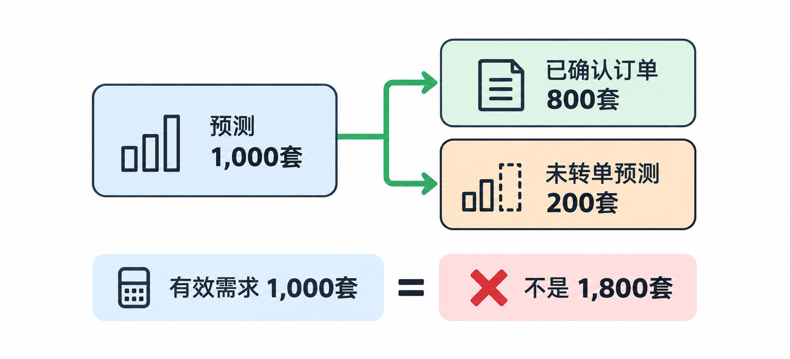
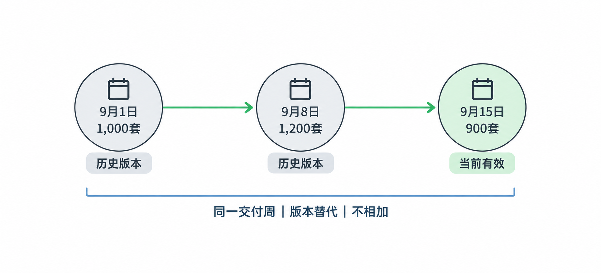
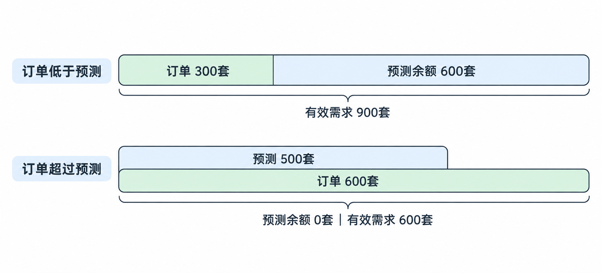
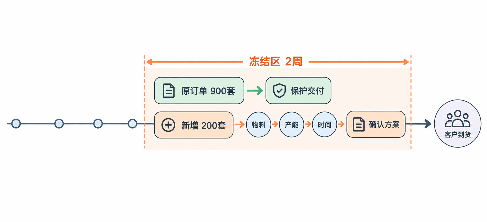
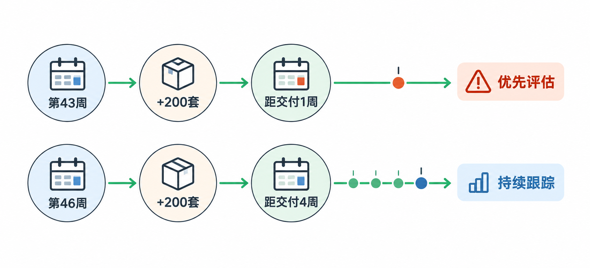
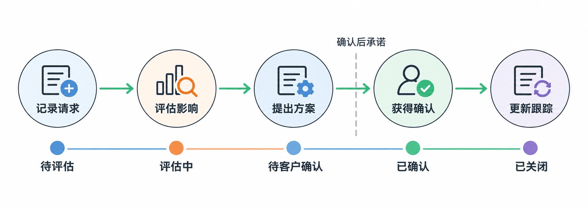
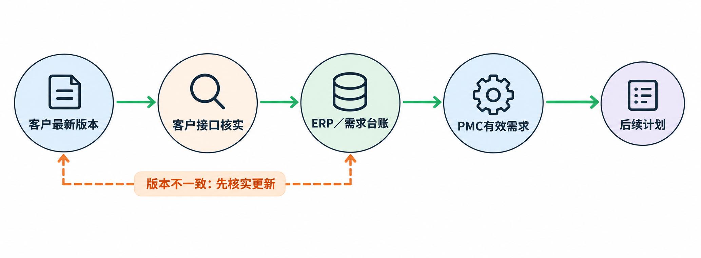

# 第三章 需求管理

本章目标：区分预测与正式订单；整理同一产品、同一交付周的需求并避免重复计算；解释需求变化对物料准备和交付的影响；识别滚动预测中的变更风险。

[TOC]

## 3.1 需求预测与正式订单

客户先告知第42周预计需要 `WH-A100` 1,000套，两周后又下达第42周正式订单800套。PMC需要判断这两条记录是否属于同一批需求，不能看到两行数量就直接安排1,800套。

  

### 预测与订单各自的作用

| 类型 | 含义 | 对PMC的作用 |
|---|---|---|
| 需求预测（Forecast） | 客户对未来需求的预估，可能随整车生产计划变化 | 帮助工厂提前评估物料与产能 |
| 客户订单（Customer Order） | 客户正式下达的需求，通常带有明确数量和交付时间 | 是安排交付的重要依据 |

若800套订单确实由原第42周1,000套预测转来，则它已占用其中800套，尚有200套预测未转成订单。此时把1,000与800相加，会重复计算相同需求，导致多备料、库存占用，并增加呆滞风险。800套小于1,000套本身不足以证明两者可以抵消；必须核对需求身份。

### 订单抵扣预测前的核对

| 核对信息 | 要确认什么 |
|---|---|
| 产品编码与版本 | 是否都是同一版 `WH-A100` |
| 客户与收货地点 | 是否交给同一个需求方、同一个地点 |
| 需求日期或交付周 | 订单是否对应预测的第42周 |
| 订单与预测的关联信息 | 客户是否说明订单由哪条预测转成 |
| 需求状态 | 原预测是否已更新或取消 |

例如，若800套订单要求第41周交付，就不能直接拿它抵消第42周的1,000套预测。PMC须分别查看两个交付周的需求。

常见做法是按产品、客户、交付时间和关联记录判断订单是否消耗预测；不同企业会因客户协议和需求处理规则而有所差异。当前只能在确认订单对应原预测后，得出该周剩余200套预测需求的结论。

### 已确认需求与预测余额

PMC看需求表时，既要看数量，也要看需求的确定性。假设同一版 `WH-A100`、同一客户和收货地点的需求如下；

| 交付周 | 已确认订单 | 尚未转成订单的预测 |
|---|---:|---:|
| 第42周 | 800套 | 200套 |
| 第43周 | 0套 | 1,200套 |

第42周的800套已有正式订单，PMC需要重点核对交期并准备交付。剩余200套仍是预测，需要跟踪客户是否以及何时转成订单。第43周的1,200套尚未形成正式订单，可以用于提前评估长交期物料和产能，但不能表述为客户已经下达1,200套订单。

### 长交期物料的提前评估

如果连接器采购提前期长，等第43周1,200套全部转成正式订单才开始关注，可能已经错过正常采购启动时间。物料无法按时可用，就会影响生产安排并增加交付风险。

判断时间风险时，要从客户交付日往前看：生产和交付需要多少时间，连接器何时必须可用，采购最迟何时启动。这里需要关注相关环节的累计提前期；单看采购天数不足以判断最终交付是否可行。具体日期倒排还要结合工作日规则验证。

针对第43周尚未转成订单的1,200套预测，PMC应先核对预测可信度、连接器库存和在途量、供应商交期，再结合客户协议和企业规则判断是否提前采购。直接按全部预测下单，若客户需求下降，可能形成多余库存。常见做法是在交付风险和库存风险之间评估，但不同企业会因客户协议、物料通用性和采购规则而有所差异。

## 3.2 滚动预测的版本变化与采购影响

客户会随着整车生产计划变化，定期更新未来各周的需求。PMC若把历次更新相加，会把同一交付周的需求重复计算；若只看最新数量而不看变化，又可能忽略已经采购的物料。

  

### 同一交付周的三次预测更新

滚动预测（Rolling Forecast）是客户定期更新未来一段时间预测的做法。下面三次更新都指向同一客户、同一版 `WH-A100` 的第43周需求；数量为教学模拟数据。

| 预测版本收到时间 | 对第43周的预测 | 相对上一版的变化 |
|---|---:|---:|
| 9月1日 | 1,000套 | — |
| 9月8日 | 1,200套 | 增加200套 |
| 9月15日 | 900套 | 减少300套 |

这三行是同一交付周的不同版本，不能相加为3,100套。9月15日的900套还比9月1日的1,000套少100套。PMC应保留版本和收到时间，核对客户当前认可的版本及变更原因，再评估需求变化对已安排采购、生产和交付的影响。

### 需求下降后的物料核对

假设工厂在9月8日按1,200套需求安排了专用连接器采购，而9月15日收到900套预测。应先核对两类信息：

1. **需求侧：**900套是否为客户当前有效版本，是否已有正式订单，后续周是否仍需这种连接器，以及需求下降的原因和持续性。
2. **供应侧：**采购订单是否已发出、供应商是否已生产、能否改量或取消、已经到货或在途多少、现有库存多少，以及其他订单能否使用该连接器。

如果每套恰好使用1个该连接器，且没有其他需求或库存差异，按1,200套准备与当前900套预测相差300个。这只是**待评估的潜在多余量**，并不等于已经确认300个呆滞料；还需核实BOM用量、库存与在途、后续需求、替代使用可能和供应商变更条件。

## 3.3 有效需求表

PMC可能同时收到客户的预测文件、正式订单和预测更新。如果把所有文件中的数量逐行相加，同一交付周的旧预测和新预测、预测与对应订单都可能被重复计算。有效需求表要回答：某产品在某个交付周当前需要考虑多少套，其中多少套已有正式订单、多少套仍是预测。

### 需求记录的必要字段

| 字段 | 业务用途 |
|---|---|
| 产品编码及版本 | 防止不同产品或版本混在一起 |
| 客户及收货地点 | 判断是否属于同一需求方和交付地点 |
| 交付日期或交付周 | 判断需求落在哪个时间段 |
| 需求类型 | 区分预测与正式订单 |
| 数量与单位 | 确认需求规模，避免套与件等单位混淆 |
| 收到时间或版本 | 区分同一交付周的历次更新 |
| 当前状态 | 标明有效、被替代或取消 |
| 订单与预测的关联 | 判断正式订单是否占用原预测 |

原始记录应保留，以便追溯客户如何变更；用于计划判断的汇总表只采用当前有效预测和有效订单。先按产品版本、客户、收货地点与交付周分组，再依据客户协议确认订单如何占用预测。

### 按版本和订单关联汇总

假设同一客户、同一收货地点，订单明确对应同产品版本、同交付周的预测，且较新的有效预测替代旧版。

| 原始记录 | 产品与交付周 | 类型与数量 | 状态或关联 |
|---|---|---|---|
| F-01 | `WH-A100 V1`，第43周 | 9月8日预测1,200套 | 已由F-02替代 |
| F-02 | `WH-A100 V1`，第43周 | 9月15日预测900套 | 当前有效 |
| O-01 | `WH-A100 V1`，第43周 | 9月16日订单300套 | 对应F-02 |
| F-03 | `WH-A100 V1`，第44周 | 9月15日预测700套 | 当前有效 |
| F-04 | `WH-B200 V1`，第43周 | 9月15日预测500套 | 当前有效 |
| O-02 | `WH-B200 V1`，第43周 | 9月16日订单600套 | 对应F-04 |

整理后的结果如下。第43周 `WH-A100` 的旧预测1,200套不再与新预测900套相加；300套正式订单占用900套预测的一部分。`WH-B200` 的订单超过预测时，不能因为预测只有500套而忽略已经确认的600套。

| 产品与交付周 | 当前有效预测 | 已确认订单 | 尚未转单的预测 | 当前合计需考虑的需求 |
|---|---:|---:|---:|---:|
| `WH-A100 V1`，第43周 | 900套 | 300套 | 600套 | 900套 |
| `WH-A100 V1`，第44周 | 700套 | 0套 | 700套 | 700套 |
| `WH-B200 V1`，第43周 | 500套 | 600套 | 0套 | 600套 |

这些计算只在订单与预测确实对应、并采用本例预测消耗规则时成立。不同客户可能采用不同消耗窗口或匹配规则。有效需求表只整理需求数量，不能证明物料、产能和交期已经可行。

  

### 有效需求与关键物料可用量

整理出有效需求后，还须用物料可用量检查是否存在供给缺口。例如第44周 `WH-A100` 有已确认订单900套、尚未转单预测300套，有效需求合计1,200套；每套需1个专用连接器，投产前共有1,000个可用，且暂假设这些连接器未分配给其他订单。相对有效需求，缺口为 `1,200－1,000＝200` 个。

常见处理顺序是先保障已确认的900套订单，余下100个连接器可支持100套预测，因此300套预测中仍有200套暂时没有连接器支持。**剩余物料100个**与**未覆盖预测200套**是两个不同数量，不能混淆。预测需求仍需跟踪客户是否转成订单，以及下一批连接器能否提前到位。实际分配还应核对产品版本、质量状态、其他订单占用和客户约定。

### 有效需求与变化量的Excel计算

PMC需要从需求表看出当前有多少订单必须交付、还有多少预测尚未转单，以及当前有效需求比上次变化多少。Excel公式应固定这些业务判断，而不能只计算预测的变化。以下数据均为教学模拟，并假设订单明确对应同一客户、产品版本、收货地点和交付周的当前预测。

| 行 | B：上次有效需求 | C：当前预测 | D：已确认订单 | E：未转单预测 | F：当前有效需求 | G：需求变化 |
|---|---:|---:|---:|---:|---:|---:|
| 2 | 700 | 800 | 500 | 300 | 800 | 100 |

| 字段 | Excel公式 | 本例结果 | 业务含义 |
|---|---|---:|---|
| E2：未转单预测 | `=MAX(0,C2-D2)` | 300 | 从当前预测扣除对应订单，已确认订单超过预测时，剩余预测最低为0 |
| F2：当前有效需求 | `=D2+E2` | 800 | 已确认订单加尚未转单预测，避免重复计算，也不能漏掉预测余额 |
| G2：需求变化 | `=F2-B2` | 100 | 当前有效需求与上次有效需求的差额，正数表示增加 |

计算顺序不能颠倒。若只用 `=D2` 作为F2，会漏掉仍需提前准备的300套预测。若E2仅写 `=C2-D2`，在订单超过预测时会出现负数；负的“未转单预测”没有业务意义。若G2写 `=C2-B2`，在本例虽然碰巧也是100，但当订单超过预测时会低估需求变化。

### 订单超过预测时的计算

保持B2为700、C2为800，把D2改成900：

| 上次有效需求 | 当前预测 | 已确认订单 | 未转单预测 | 当前有效需求 | 需求变化 |
|---:|---:|---:|---:|---:|---:|
| 700 | 800 | 900 | 0 | 900 | +200 |

此时900套订单已超过800套预测，未转单预测为0；当前有效需求至少为900套。需求变化为 `900－700＝200`，不能用 `800－700＝100` 代替。

“上次”与“当前”必须是同一客户、产品版本、收货地点和交付周的有效需求快照。订单与预测不对应、交付周不同或客户规则不同，都不能直接套用本例公式。

> 计算出有效需求仍不代表物料、产能和交期已经可行。

## 3.4 冻结区内的需求变更

线束工厂已经按客户确认数量采购物料、安排人员和生产。临近交付时突然改变数量或日期，可能同时影响物料、产能和交付。因此，客户与工厂可能约定：临近交付的一段时间内，已确认需求原则上保持稳定；若需要变更，须先评估并确认。这段时间称为**需求冻结区（Frozen Zone）**。冻结区的长度和变更规则由双方约定，不同企业可能不同。

假设双方约定交付前2周进入冻结区。第43周的 `WH-A100` 正式订单为900套；进入冻结区后，客户要求再增加200套。此时不能只把需求表改成1,100套并立即承诺原交期。PMC要分别保护原900套交付，并评估新增200套是否可行。

  

至少核对三类数据：

1. **物料：**新增200套所需连接器及其他物料是否齐套；若未齐套，何时可用，是否赶得上投产。
2. **产能：**压接、总装、检验等相关工序在需要的日期是否有能力生产新增200套，是否会挤占原订单。
3. **时间：**从物料可用到生产、检验和运输，各环节需要多少时间；客户要求的到货日期是否仍可实现。

### 分批交付的判断边界

若原900套的物料、产能和运输条件仍满足，可以维持原交期，并将新增200套作为单独的交付风险与客户沟通。若关键连接器只能支持原900套，必须说明新增量的物料缺口、预计最早可用时间、后续生产和运输所需时间，以及核实后的最早交付日期，再确认客户是否接受分批交付。

**物料可用日期不等于客户到货日期。**例如，新增200个连接器比原计划晚3天可用，之后生产与检验需1天、运输需1天，且相关产能可用，则新增200套最早可能晚5天到货。若排产没有空档，还会更晚；不能未经核实就承诺“晚3天交付”。以上天数只是教学模拟，实际应按具体日期和工作日规则倒排。

## 3.5 数量增加与交期提前的风险判断

两条需求变更都增加200套，PMC不能只按增量大小排处理顺序。距交付时间不同，采购、生产和运输可调整的空间也不同。应先判断哪条变更更可能造成近期交付风险。

| 产品与交付周 | 原预测 | 新预测 | 增量 | 距交付时间 |
|---|---:|---:|---:|---|
| `WH-A100`，第43周 | 900套 | 1,100套 | 200套 | 约1周 |
| `WH-A100`，第46周 | 900套 | 1,100套 | 200套 | 约4周 |

两周的绝对增量相同，但第43周更近，通常应先评估。这里的优先评估不等于立即承诺或立即采购；仍须核对现有可用资源和剩余时间。第46周也要跟踪，只是通常有更多时间确认客户需求、供应商交期和产能。

  

### 成品库存、物料与剩余时间

至少看两组数据：

1. **可用资源：**有没有尚未分配、质量合格且符合产品版本的成品库存；若只有原材料，还要核对BOM所需物料、在途到货日和可用日期。不能把原材料库存直接当作可交付成品。
2. **剩余时间与能力：**从当前到客户到货日，压接、总装、检验和运输能否完成新增200套；相关工序是否有产能空档，是否会挤占已有订单。

例如，若已有200套未分配的合格成品，新增需求可能较容易满足，但仍需确认交付地点和运输；若只有200套所需连接器，则还需检查其他物料、各工序产能和剩余交付时间。

### 客户提前交期时重算物料与交付时间

订单数量不增加，也可能产生新的交付风险。客户把到货日期提前，会压缩物料、生产、检验和运输原本可用的时间。PMC不能仅因“数量没变”就沿用旧计划或立即承诺新交期。

客户原定第45周接收600套 `WH-B200`，现在要求提前到第44周，数量仍为600套。关键连接器原计划在第44周周五可用；此后生产与检验还需2个工作日，运输需1个工作日。按现有条件，不能直接承诺第44周交付：连接器周五才可用，之后至少还需3个工作日，且这仍以其他物料齐套、产能和运输资源可用为前提。

### 加急、成品库存与调配方案

1. 联系供应商确认连接器是否可提前生产、发运并完成入厂检验，明确最早**可用**日期，而不只看到货日期。
2. 核对是否有质量合格、版本匹配、尚未分配的 `WH-B200` 成品库存可直接交付。
3. 评估从其他订单调配连接器的可能性，同时核对被调配订单的交付承诺和代价，不能无评估地转移风险。
4. 若仍无法按新要求交付，核实生产、检验和运输后可实现的最早客户到货日期，再与客户协商交期或分批方案。

从连接器可用起还需3个工作日，不等于比客户要求的日期“晚3个工作日”。题目只给出第44周，没有给出具体客户到货日；只有确认到货日并按工作日倒排后，才能准确计算延期天数。

## 3.6 需求变更与交付承诺

客户提出变更后，如果PMC只修改需求表，采购、仓库、生产和客户可能各自依据不同版本行动。变更需要记录请求、评估影响、形成方案、得到客户确认，并跟踪执行结果；客户未确认前不能把新数量或新交期写成已承诺。

### 记录、评估、确认与执行

1. **记录请求：**产品版本、客户、收货地点、原数量与日期、新数量与日期、收到时间、提出方及变更原因。
2. **核对影响：**可交成品、关键物料及到货、工序产能、检验与运输、其他订单的承诺。
3. **提出方案：**说明可交数量、各批次最早到货日、所需条件及对其他订单的代价。
4. **获得确认：**客户确认接受的数量、日期和分批安排；内部各责任方确认能够执行。
5. **更新并跟踪：**同步有效需求和执行计划，跟踪采购、生产、发货及客户收货，保留版本与决策记录。

  

需求变更记录的状态可区分“待评估”“评估中”“方案待客户确认”“已确认”“已关闭”等。状态名称可因企业而异，但**客户请求**与**已承诺方案**不能混淆。

客户要求将600套 `WH-B200` 从第45周提前到第44周。仓库确认有200套质量合格且未分配的成品；剩余400套所需连接器要到第44周周五才可用。客户尚未接受分批交付。

此时变更应记为“评估中”，不能记成“第44周已承诺交付600套”。200套成品可作为第一批候选方案，但须核对产品版本、收货地点、运输安排和客户是否接受。其余400套从连接器可用后至少还需生产检验2个工作日和运输1个工作日；若产能或其他物料不具备，所需时间更长。因此只能在核实后提出最早交付日期，不能简单说“第二批在第一批三天后交付”。

供应商口头承诺加急到厂，不等于物料已能投产。PMC需要确认供应商可兑现的到厂时间、入厂检验完成后的**可用时间**，再核对生产检验所需工作日、产能空档及运输到货日。已经验证可按期交付的批次应单独保护；受缺料影响的批次应单独给出有条件的最早日期，并在客户确认前保持方案待确认状态。

例如，客户要求第44周周五收到1,200套，其中1,000套已确认可按时交付，剩余200套的连接器若到第44周周三完成检验并可用，周四、周五完成生产与检验，下周一运输到货，则可向客户提出“1,000套第44周周五、200套第45周周一”的分批方案。该方案仍以产能、其他物料和运输落实及客户接受为条件；不能仅说“尽力提前”，也不能在供应商只作口头承诺时直接保证全部按周五交付。

## 3.7 需求版本向计划环节传递

客户已经更新预测，但内部系统仍保留旧版时，PMC可能用错误数量准备物料和产能。需求管理不仅要算对数量，还要保证客户当前有效版本及时、准确地传给后续计划环节。

### 谁接收、维护和使用需求

| 环节与使用者 | 上游输入 | 该环节的输出 | 下游及对PMC的作用 |
|---|---|---|---|
| 客户接口人员 | 客户预测、正式订单、变更通知 | 核对来源、产品版本、交付日期、数量和需求版本后的记录 | 交给企业的需求台账或ERP维护 |
| 企业资源计划系统（Enterprise Resource Planning, ERP）或需求台账；由客户接口人员维护，PMC查询 | 有效预测与订单、历史变更 | 可查询的当前需求及版本记录 | PMC据此整理有效需求，避免使用过期版本 |
| PMC | 当前有效需求、库存、交期及相关业务数据 | 有效需求表、变更风险、待确认事项 | 为后续产销协同和生产计划评估提供需求输入 |

  

具体企业可能使用客户平台、接口、ERP或人工台账接收需求，系统名称和职责分工会不同；核心是能追溯客户原始通知、内部当前版本及变更确认。ERP中有数量，不等于物料、产能和交期已经可行。

### 客户版本与ERP记录不一致

客户把第43周 `WH-A100` 预测从900套改为1,100套，ERP仍显示旧版900套。若PMC直接用旧数据做计划，会漏掉新增200套，低估物料和产能需求，增加交付风险。应先由客户接口人员核实客户通知的1,100套是否为当前有效版本，更新ERP或需求台账并保留变更记录；随后PMC重新整理有效需求并评估新增200套的交付可行性。
